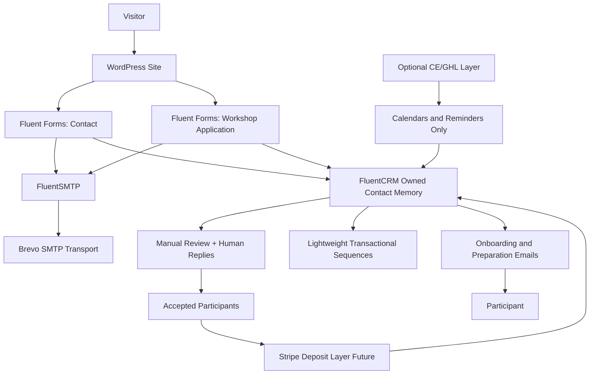

# Fuehrenundfolgen Operational Integration Architecture

## 1) High-Level Architecture Map

- **Primary system of record:** FluentCRM (owned relationship memory).
- **Primary delivery surface:** WordPress + Fluent Forms.
- **Outbound reliability:** FluentSMTP via Brevo SMTP only.
- **Payments:** Stripe added after acceptance step (not before).
- **CE/GHL role:** optional helper for reminders/calendars only; not relationship source of truth.

## 2) Operational Flow Map

### Contact Flow (A)
- **Form fields (minimum):** first name, last name, email, message, optional phone, consent checkbox.
- **Submission actions:** store entry, create/update FluentCRM contact, apply tags, send admin notification, send calm confirmation to sender.
- **Tags:**
  - `source:website`
  - `flow:contact`
  - `topic:general` (default, manual update optional)
  - `status:new-inquiry`
- **Notification structure:**
  - Internal: immediate email to workshop inbox + optional second owner inbox.
  - External: short confirmation with expected reply window (e.g. 1-2 business days).
- **Follow-up logic:**
  - No auto-nurture sequence.
  - Manual human reply is primary.
  - If no internal reply after SLA window, one internal reminder only.
- **Anti-spam approach:** Fluent Forms honeypot + nonce + reCAPTCHA v3 (or hCaptcha) + basic rate-limiting at host/WAF level.
- **Tone direction:** concise, respectful, operational (no sales language).

### Application Flow (B)
- **Form fields (practical MVP):**
  - identity: first name, last name, email, phone optional, city/country
  - professional context: role/function, current work environment
  - pressure context: where reliability/timing breaks down
  - motivation: why this workshop now
  - readiness: willingness for direct feedback and physically present practice (checkbox)
  - logistics: availability for dates, language preference (DE/EN)
  - consent + privacy acknowledgement
- **Optional qualification logic (light):**
  - Conditional field if readiness checkbox is not selected -> prompt clarifying statement.
  - No hard gate automation; route to manual review.

### CRM Data Model: Tags vs Lists vs Fields
- **Lists (stable, few):**
  - `Contacts`
  - `Applicants`
  - `Participants`
  - `Alumni`
- **Tags (state and context):**
  - states: `state:inquiry`, `state:applicant`, `state:conversation-scheduled`, `state:accepted`, `state:waitlist`, `state:confirmed`, `state:deposit-paid`, `state:alumni`
  - source/context: `source:website`, `workshop:zurich-2026-10`
- **Custom fields (minimal but useful):**
  - `application_date`
  - `workshop_cohort`
  - `conversation_date`
  - `decision_status`
  - `decision_date`
  - `deposit_status`
  - `deposit_due_date`
  - `language_pref`
  - `notes_internal`

### Minimal Viable Application Workflow
- submit form -> create/update contact -> assign `Applicants` list + `state:applicant` tag
- internal notification -> manual review
- manual status progression by tag update
- accepted -> send acceptance email + next steps
- confirmed/deposit paid -> move to onboarding sequence

## 3) Communication Architecture (C)

### Keep Manual
- Application review decisions.
- Conversation scheduling for fit/alignment.
- Acceptance vs waitlist decisions.
- Sensitive participant questions.

### Safe Automation
- Form confirmations.
- Internal submission alerts.
- Status-change transactional emails (accepted, waitlist, confirmed, prep package sent).
- Reminder emails tied to fixed workshop milestones.

### Broadcasts (limited and appropriate)
- Cohort-level logistics update.
- Preparation reminder (e.g., 14 days and 3 days before workshop).
- Post-workshop follow-up and alumni update (light cadence only).

### Optional CE/GHL Later
- Calendar booking sync and reminder orchestration.
- SMS reminders if explicitly desired.
- Keep one-way sync back into FluentCRM via webhook/Zapier/Make; never replace FluentCRM as source of truth.

## 4) Payment / Deposit Logic (D)

### Future-Ready Minimal Architecture
- **Trigger:** only after `state:accepted`.
- **Payment object:** Stripe Payment Link or Stripe Invoice per cohort.
- **Flow:** acceptance email -> deposit link -> payment confirmation -> CRM state update to `state:deposit-paid`.
- **Onboarding tie-in:** deposit-paid triggers preparation sequence and practical info pack.
- **Reversibility:** can run manually first (send Stripe link manually), then automate webhook updates later.

### Suggested payment states
- `deposit:not-requested`
- `deposit:requested`
- `deposit:paid`
- `deposit:overdue` (manual handling)

## 5) Recommended Plugin/Service Responsibilities
- **WordPress:** publishing and owned web surface.
- **Fluent Forms:** contact/application forms and field logic.
- **FluentCRM:** owned contact memory, tags, lists, status lifecycle.
- **FluentSMTP:** delivery routing and reliability layer.
- **Brevo:** SMTP transport only.
- **Stripe (phase 2):** deposit/payment collection.
- **CE/GHL (optional):** reminder/calendar amplification only.

## 6) Minimal Viable Setup (Phase 1)
- Configure FluentSMTP with Brevo and verify deliverability.
- Build Contact form + Application form with required fields and anti-spam.
- Create CRM lists/tags/custom fields above.
- Implement 5 transactional templates:
  - contact confirmation
  - application confirmation
  - accepted
  - waitlist
  - confirmed + preparation
- Define internal SLA policy:
  - contact reply window
  - application review window
- Manual-first ops cadence with weekly CRM hygiene review.

## 7) Future Expansion Options
- Stripe webhook -> auto tag updates and deposit status automation.
- Cohort templates duplicated per workshop cycle.
- Alumni segmentation by cohort and role context.
- Optional CE/GHL reminder flows if manual reminder load grows.

## 8) Risks / Friction Points to Avoid
- Too many tags without governance -> state confusion.
- Over-automation of applicant communications -> loss of trust tone.
- Dual system authority (FluentCRM vs CE/GHL) -> data drift.
- Premature payment automation before acceptance workflow is stable.
- Missing SLA ownership for inboxes -> slow response and confidence loss.

## Governance Notes
- Keep a single owner for state transitions.
- Use explicit naming conventions (`state:*`, `source:*`, `workshop:*`).
- Prefer human review over branch-heavy automations.
- Review and prune unused tags/fields monthly.
